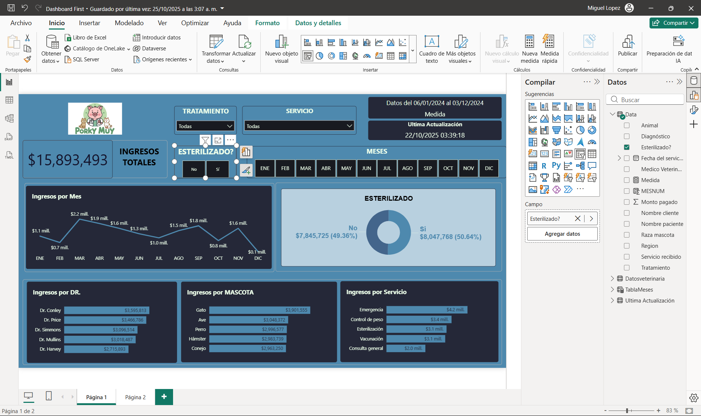

# Dashboards Interactivos de Business Intelligence 📊 

Bienvenido a mi colección de soluciones de BI. Este repositorio aloja proyectos completos desarrollados en **Power BI**, demostrando habilidades en modelado de datos, DAX avanzado y diseño de UX centrado en la toma de decisiones.

## Estructura del Repositorio 📁 

- `dashboards/`: Archivos fuente `.pbix` (Power BI Desktop).
- `data/`: Datasets originales (Excel/CSV) utilizados para los modelos.
- `media/`: Capturas de pantalla y GIFs demostrativos.

---

## Proyecto Destacado: Dashboard de Ventas "Porky Muy" 🏆 

Un panel analítico diseñado para monitorear el rendimiento comercial, permitiendo a los gerentes identificar tendencias de ingresos, productos estrella y comportamiento del cliente.

### Vista Previa 📸 

### Tecnologías Aplicadas 🛠️ 
- **Power Query (ETL)**: Limpieza y transformación de datos crudos de ventas.
- **Modelado de Datos**: Esquema Estrella (Star Schema) para optimizar el rendimiento.
- **DAX Avanzado**:
    - Cálculos de Inteligencia de Tiempo (YTD, YoY Growth).
    - Medidas dinámicas para KPIs.
- **Visualización**: Diseño de alto contraste (Dark Mode) con navegación intuitiva.

### Insights Clave 💡 
1.  **Análisis Temporal**: Capacidad de profundizar (Drill-down) de vista anual a diaria.
2.  **Segmentación**: Análisis de ingresos cruzado por "Doctor" (Vendedor) y Tipo de Mascota.
3.  **KPIs**: Indicadores claros de Ingresos Totales y Servicios Realizados.

---

## Cómo ver el Dashboard interactivo 🚀 

1.  **Opción A (Recomendada)**: [Ver Online (Enlace Público)](#) .
2.  **Opción B (Local)**:
    - Descarga el archivo `.pbix` de la carpeta `dashboards/`.
    - Ábrelo con [Power BI Desktop](https://powerbi.microsoft.com/desktop/).

---

### Contacto 📬 
¿Te interesa discutir cómo los datos pueden transformar tu negocio?
- **LinkedIn**: www.linkedin.com/in/jony-franco-163521358 (#)
- **Email**: francojonysenati@gmail.com (#)
